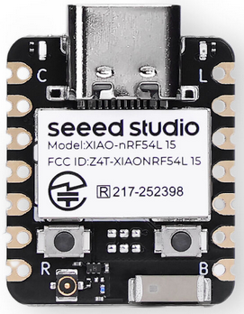
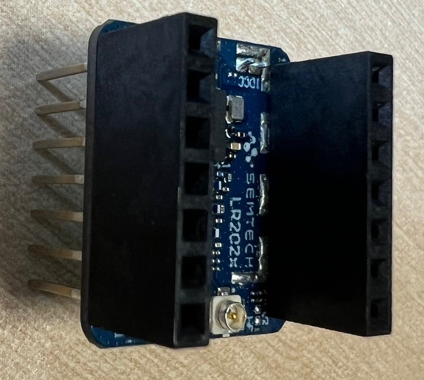
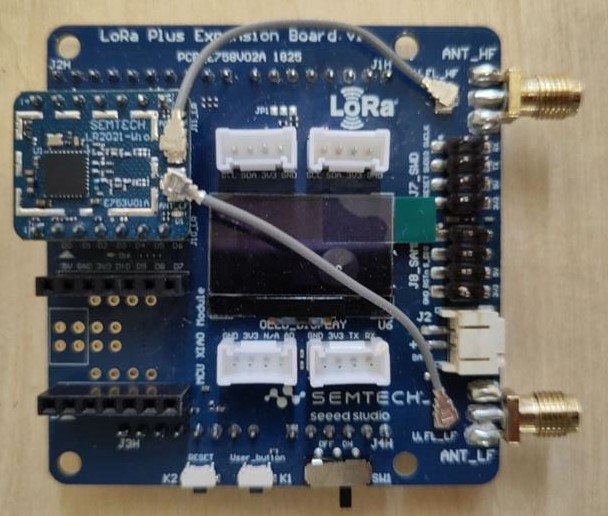
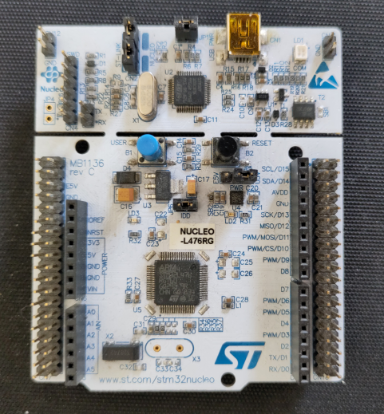
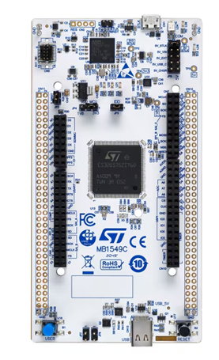
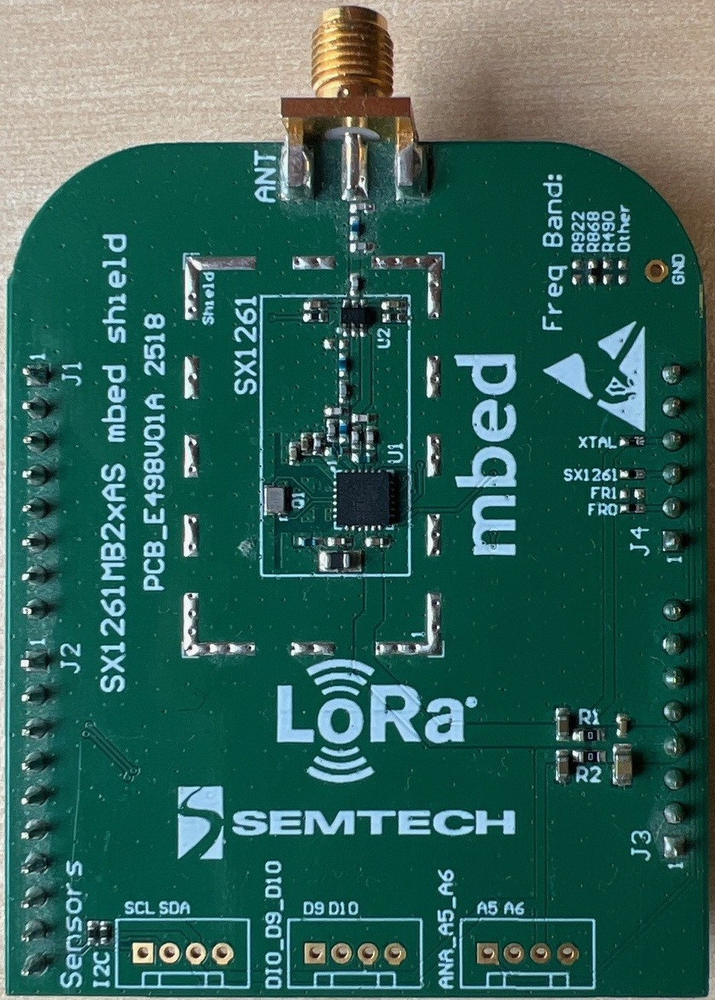
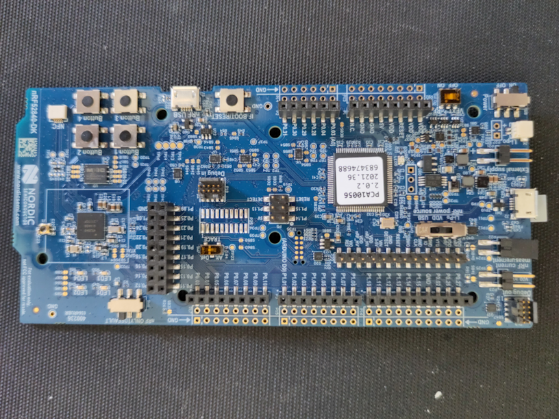
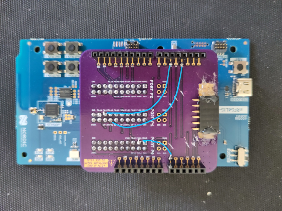

# USP For Zephyr

**USP for Zephyr** integrates Semtech’s Unified Software Platform **[USP](https://github.com/Lora-net/usp)** into the Zephyr RTOS, which leverage fourth-generation LoRa® technology and providing ready-to-use advanced multi-protocol support.

This **out-of-tree Zephyr module** supports flexible integration ([see Zephyr topologies](https://docs.zephyrproject.org/latest/develop/west/workspaces.html#topologies-supported)):
- **Standalone** - for evaluation, direct use of provided samples (manifest repository),
- **Integrated in Custom Applications** - importation into applications's manifest (application as manifest),
- **Integrated in Downstream Distributions** - integration into Zephyr-based distributions (experimental with Nordic Connect SDK, distribution's manifest)

For an in-depth explanation of system components, interactions, and design principles, refer to [USP Architecture](doc/USP_Architecture.md).

Current Version is v1.0.0:
- [Changelog](CHANGELOG.md)
- [known limitations](doc/KNOWN_LIMITATIONS.md)

## Prerequisites

Install Zephyr 4.2 following : https://docs.zephyrproject.org/latest/develop/getting_started/index.html. \
If using a natively-supported MCU Board, you may test it with `blinky` sample. \
Note: Advanced users may install only the dependancy tools & SDK.

Notes regarding SDK & Toolchains :
- The Zephyr SDK contains toolchains for each of Zephyr’s supported architectures (i.e arm, x86, ...). That does include a compiler, assembler, linker and other programs required to build and debug Zephyr applications.
- Only the SDK files of the targeted MCU may be installed
- **Zephyr RTOS Version Support:**
  - Samples are Validated<sup>1</sup> with **Zephyr RTOS v4.2 & Zephyr SDK v0.17.0.**
  - Samples are Buildable<sup>1</sup> with **Zephyr RTOS v3.7.0 LTS & Zephyr SDK v0.16.9.** (see [Supported Boards & Shields](#supported-boards--shields) for limitations)
- Follow steps [here](https://docs.zephyrproject.org/4.2.0/develop/getting_started/index.html#install-the-zephyr-sdk) to install/update the Zephyr SDK on your specific platform. This needs to be done only once.
- Ensure your SDK is compliant with the used version of Zephyr RTOS : https://github.com/zephyrproject-rtos/sdk-ng/wiki/Zephyr-Version-Compatibility
- To use other Toolchains than the one provided by default with the Zephyr SDK, please refer to https://docs.zephyrproject.org/latest/develop/toolchains/index.html (**Please be aware that the current delivery was not validated with other toolchains than the one from the default Zephyr SDK**)

> <sup>1</sup>`Validated` : passed the Semtech nominal validation process.<br>`Buildable` : can be compiled but did not go through full Semtech validation process and can be considered experimental.<br>`Might work` : was compiled and tested on `periodical_uplink` sample only with low validation

## Setup

<details>
<summary><b>Standalone Workspace (Simplest for Evaluation)</b></summary>
<br>

Install USP Zephyr in a different directory than your default upstream zephyr installation:

```bash
# Create and initialize workspace
mkdir zephyr_workspace
cd zephyr_workspace
git clone https://github.com/Lora-net/usp_zephyr.git
west init -l usp_zephyr
west update
```

You can check that the module is correctly recognized by Zephyr:

```bash
west list usp_zephyr
```

Notes:
- USP Zephyr is used as the manifest repository.
- The Zephyr installation & USP Zephyr Setup was tested for both Linux & Windows Development OS.

</details>

<details>
<summary><b>Integration in Custom application</b></summary>
<br>

Example of Integration in a Custom Application with T2 Star topology (could be extended to T3):
```bash
mkdir application_zephyr_workspace & cd application_zephyr_workspace
mkdir application # or git clone https://xxxxx application
```

Edit there your `application/west.yml` manifest file choosing the revision of ups_zephyr & ups :
<div style="display: flex; gap: 2em;">
  <div>
    <h3>Simple dependency description</h3>
    <pre>
manifest:
  projects:
    - name: usp_zephyr
      path: usp_zephyr
      url: https://github.com/Lora-net/usp_zephyr.git
      revision: develop
      import: true
  self:
    path: application
    </pre>
  </div>
  <div>
    <h3>Advanced dependency description with selected versions</h3>
    <pre>
manifest:
  projects:
    - name: zephyr
      url: https://github.com/zephyrproject-rtos/zephyr
      revision: v4.2.0
      import: true
    - name: usp_zephyr
      path: usp_zephyr
      url: https://github.com/Lora-net/usp_zephyr.git
      revision: v1.0.0
    - name: usp
      path: modules/lib/usp
      url: https://github.com/Lora-net/usp.git
      revision: v1.0.0
      submodules: true
  self:
    path: application
    </pre>
  </div>
</div>

and do :
```bash
west init -l application
west update
```

Work in your source files in `application_zephyr_workspace/application`
```bash
application/my_project
├── boards
├── CMakeLists.txt
├── prj.conf
├── README.rst
└── src
```

And compile & flash as usual :
```bash
west build --board xiao_nrf54l15/nrf54l15/cpuapp --shield semtech_wio_lr2021 application/xxx
west flash
```

</details>

<details>
<summary><b>Integration in NCS workspace (experimental)</b></summary>
<br>

**WARNING : This integration is experimental as the official validated integration is for Zephyr RTOS v4.2**

Can be used for T2/T3 topology.
Edit `nrf/west.yml` (or your manifest):

   ```yaml
   manifest:
     projects:
       - name: usp_zephyr
         path: modules/usp_zephyr
         url: https://github.com/Lora-net/usp_zephyr.git
         revision: feature/usp_zephyr
         import: true
   ```

Update workspace:
   ```bash
   west update
   ```

Check that the module is correctly detected by Zephyr:

```bash
west list usp_zephyr
```

Install **pyOCD**:
   ```bash
   pip install pyocd
   ```

**WARNING DISABLE SYSBUILD**
- At compilation, use the `--no-sysbuild` parameter :
```
west build --pristine --board <board> --shield <shield> --no-sysbuild
```

</details>


## Build and Run in the Standalone Workspace

Using the Semtech LoRa Plus Xiao EVK (Xiao-nRF54L15 + LR2021-Wio) on `periodical_uplink` sample :

```bash
cd zephyr_workspace
west build --pristine --board xiao_nrf54l15/nrf54l15/cpuapp --shield semtech_wio_lr2021 usp_zephyr/samples/usp/lbm/periodical_uplink
west flash
```

All samples are located in [`samples/usp`](samples/usp/README.md) directory, you can use any supported board/shield as define in next section to build and flash other samples :

```bash
west build --pristine --board <board> --shield <shield>
```

For more details on Samples, refer to [Samples Documentation](samples/usp/README.md)

## Supported Boards & Shields


<details>
<summary><strong>Seed Studio [XIAO nRF54L15] and [XIAO ESP32S3]</strong></summary>
<br>

-   **Supported Zephyr:** Validated<sup>1</sup> on 4.2

-   **Build board option**

    >   | Type | Status<sup>1</sup> | Image | Command |
    >   |------|-------|--------|---------|
    >   | [**Xiao nRF54l15**](https://www.seeedstudio.com/XIAO-nRF54L15-p-6493.html) | Validated |  | `--board xiao_nrf54l15/nrf54l15/cpuapp` |
    >   | [**Xiao ESP32S3**](https://wiki.seeedstudio.com/xiao_esp32s3_zephyr_rtos/)**<sup>2</sup>** | Might work<br>(only tested with<br>--shield semtech_wio_lr2021) |  | `--board xiao_esp32s3/esp32s3/procpu` |

-   **Build shield option**


    >   | Type | Status<sup>1</sup> | Image | Command |
    >   |------|--------|--------|---------|
    >   | **Wio-LR2021 Standalone<sup>3</sup>** | Validated for Xiao nRF54l15 |  | `--shield semtech_wio_lr2021` |
    >   | **Wio-LR2021 LoRa Plus Expansion Board<sup>3</sup>** | Validated for Xiao nRF54l15 |  | `--shield semtech_loraplus_expansion_board --shield semtech_wio_lr2021` |

    > <sup>1</sup> `Validated` : passed the Semtech nominal validation process.<br>`Buildable` : can be compiled but did not go through full Semtech validation process and can be considered experimental.<br>`Might work` : was compiled and tested on `periodical_uplink` sample only with low validation
    >
    > **<sup>2</sup> XIAO ESP32 Binary Blobs**
    > Espressif HAL requires RF binary blobs in order work. Run the command below to retrieve those files before west build.
    > ```
    > west blobs fetch hal_espressif
    > ```
    > **<sup>3</sup> WIO-LR2021 CN version** ⚠️
    > For WIO-LR2021 China (CN) versions the PA table configuration `tx-power-cfg-lf`defined in `usp_zephyr/boards/shields/semtech_wio_lr20xx/semtech_wio_lr20xx_common.dtsi` need to be adjusted as defined in LR2021 Datasheet page 134 to (CN - 490Mhz) band for optimal performances. Look for the 2 `470MHz` prefilled tables in the `semtech_wio_lr20xx_common.dtsi` file.

-   **Flashing**

    The Xiao-nRF54 doesn't embeds a J-Link interface, it is instead interfaced with a CMSIS-DAP interface.
    We recommend using `pyocd`, version >= 0.38.0 for both flashing and debugging. By default, `pyocd` should be included when installing Zephyr requirements, it will be intalled inside the venv. Use `pyocd --version` to check the installed version. Use `pip install pyocd` if it is not already installed.
    On Debian-based systems, you may need to install additional udev rules to be able to connect to the board. You might want to follow the instructions [here](https://github.com/pyocd/pyOCD/tree/main/udev) to install PyOCD known USB devices. Additionaly, you will have to manually install `99-xiao-nrf54l15.rules` file found in `usp_zephyr/boards/seeed/xiao_nrf54l15/support` using the same procedure.

    In case you want to flash with native pyocd command, you can run:
    ```bash
    pyocd flash -t nrf54l ./build_xiao/zephyr/zephyr.hex # Replace build_xiao with your build folder name
    ```
    If you encounter an error saying the the board is locked, run
    ```bash
    pyocd erase -c --target nrf54l
    ```
    <br>

</details>

<details>
<summary><strong>STMicro [NUCLEO-L476RG] and [NUCLEO-U575ZI-Q]</strong></summary>
<br>

-   **Supported Zephyr:** Validated<sup>1</sup> on 4.2 (buildable<sup>1</sup> on v3.7.0 LTS)

-   **MCU board build option**

    >   | Type | Status<sup>1</sup> | Image | Command |
    >   |------|--------|--------|---------|
    >   | [**Nucleo-L476RG**](https://www.st.com/en/evaluation-tools/nucleo-l476rg.html) | Validated |  | `--board nucleo_l476rg/stm32l476xx` |
    >   | [**Nucleo-U575ZI-Q**](https://www.st.com/en/evaluation-tools/nucleo-u575zi-q.html)| Buildable | | `--board nucleo_u575zi_q/stm32u575xx` |

-   **RF shield build option**

    >   | Type | Status<sup>1</sup> | Image | Command |
    >   |------|--------|--------|---------|
    >   | **Wio-LR2021 LoRa Plus Expansion Board<sup>3</sup>** | Validated for Nucleo-L476RG |  | <code>--shield semtech_mbed_wio_interface --shield semtech_wio_lr2021</code> or <code>--shield semtech_mbed_wio_interface --shield semtech_loraplus_expansion_board  --shield semtech_wio_lr2021</code> |
    >   | **LR11xx (multi-option)** | Buildable |  | `--shield semtech_lr1110mb1xxs` or <br> `--shield semtech_lr1120mb1xxs` or<br>`--shield semtech_lr1121mb1xxs` |
    >   | **SX126x** | Buildabled |  | e.g. `--shield semtech_sx1261mb2bas` (cf. [boards/shields/semtech_sx126xmb2xxs](boards/shields/semtech_sx126xmb2xxs)) |

    > <sup>1</sup> `Validated` : passed the Semtech nominal validation process.<br>`Buildable` : can be compiled but did not go through full Semtech validation process and can be considered experimental.<br>`Might work` : was compiled and tested on `periodical_uplink` sample only with low validation
    >
    > **<sup>3</sup> WIO-LR2021 CN version** ⚠️
    > For WIO-LR2021 China (CN) versions the PA table configuration `tx-power-cfg-lf`defined in `usp_zephyr/boards/shields/semtech_wio_lr20xx/semtech_wio_lr20xx_common.dtsi` need to be adjusted as defined in LR2021 Datasheet page 134 to (CN - 490Mhz) band for optimal performances. Look for the 2 `470MHz` prefilled tables in the `semtech_wio_lr20xx_common.dtsi` file.

-   **Flashing**

    STM32 chips use ST-Link as interface, and are programmed using STM32CubeProgrammer tool. You might want to [download and install STM32CubeProg](https://www.st.com/en/development-tools/stm32cubeprog.html) from ST website. Then, Zephyr should be able to locate the installation folder and use the tool.

<br>

</details>


<details>
<summary><strong>Nordic [nRF54L15 DK] and [nRF52840 DK]</strong></summary>
<br>

-   **Supported Zephyr:**
    -   nRF52840 DK: Buildable<sup>3</sup> on 4.2 & v3.7.0 LTS)
    -   nRF54l15 DK: Buildable<sup>3</sup> on 4.2


-   **MCU board build option**

    >   | Type | Status<sup>1</sup> | Image | Command |
    >   |------|--------|--------|---------|
    >   | [**nRF52840 DK**](https://www.nordicsemi.com/Products/Development-hardware/nRF52840-DK) | Buildable |  | `--board nrf52840dk/nrf52840` |
    >   | [**nRF54l15 DK**](https://www.nordicsemi.com/Products/Development-hardware/nRF54L15-DK) | Buildable |  | `--board nrf54l15dk/nrf54l15/cpuapp` |


-   **RF shield build option for nRF54l15 DK**

    >   | Type | Status<sup>1</sup> | Image | Command[<sup>2</sup> |
    >   |------|--------|--------|---------|
    >   | **Wio-LR2021<br>LoRa Plus Expansion Board<sup>3</sup>** | Buildable |  | `--shield semtech_nrf54l15dk_mbed_interface --shield semtech_mbed_wio_interface --shield semtech_wio_lr2021` |
    >   | **LR11xx<br>(multi-option)** | Buildable |    | <code>--shield semtech_nrf54l15dk_mbed_interface --shield semtech_lr1110mb1xxs</code> or <code>--shield semtech_nrf54l15dk_mbed_interface --shield semtech_lr1120mb1xxs</code> or <code>--shield semtech_nrf54l15dk_mbed_interface --shield semtech_lr1121mb1xxs</code> |
    >   | **SX126x** | Buildable |  | e.g. <code>--shield semtech_nrf54l15dk_mbed_interface --shield semtech_sx1261mb2bas</code> (cf. [boards/shields/semtech_sx126xmb2xxs](boards/shields/semtech_sx126xmb2xxs)) |
    <br>

-   **RF shield build option for nRF52840 DK**

    >   | Type | Status<sup>1</sup> | Image | Command<sup>2</sup> |
    >   |------|--------|--------|---------|
    >   | **Wio-LR2021<br>LoRa Plus Expansion Board<sup>3</sup>** | Buildable |  | `--shield semtech_mbed_wio_interface --shield semtech_wio_lr2021` |
    >   | **LR11xx<br>(multi-option)** | Buildable |    | `--shield semtech_lr1110mb1xxs`<br>`--shield semtech_lr1120mb1xxs`<br>`--shield semtech_lr1121mb1xxs` |
    >   | **SX126x** | Buildable |  | e.g. `--shield semtech_sx1261mb2bas` (cf. [boards/shields/semtech_sx126xmb2xxs](boards/shields/semtech_sx126xmb2xxs)) |
    <br>

    > <sup>1</sup> `Validated` : passed the Semtech nominal validation process.<br>`Buildable` : can be compiled but did not go through full Semtech validation process and can be considered experimental.<br>`Might work` : was compiled and tested on `periodical_uplink` sample only with low validation
    >
    > **<sup>2</sup> nRF54L15 DK interface** ⚠️
    > The **nRF54L15-DK** does not provide an Arduino-compatible header like the other Nordic DK boards. Because of this, a separate interface/adapter board is required to connect Semtech shields.
    > The **--shield semtech_mbed_wio_interface** option must be added so that the correct pin mapping is applied when building the project.
    > The mandatory pins are:
    >> | nRF54L15-DK Pin | Arduino connector Pin | LRXXxx shield pin function |
    >> | --------------- | --------------------- | -------------------------- |
    >> | P0.00 | A0 | LR_NRESET |
    >> | P1.06 | D7 | NSS |
    >> | P1.11 | D3 | BUSY |
    >> | P1.12 | D5 | DIO9 |
    >> | P2.06 | D13 | SPI_SCK |
    >> | P2.08 | D11 | SPI_MOSI |
    >> | P2.09 | D12 | SPI_MISO |
    >>
    > The mandatory pin for geoloc example on shield embedding a LNA is:
    >> | nRF54L15-DK Pin | Arduino connector Pin | LRXXxx shield pin function |
    >> | --------------- | --------------------- | -------------------------- |
    >> | P1.13 | A3 | LNA_CTRL_MCU |
    >
    > Other pins:
    >> | nRF54L15-DK Pin | Arduino connector Pin | LRXXxx shield pin function |
    >> | --------------- | --------------------- | -------------------------- |
    >> | P0.01 | A5 | LED_RX |
    >> | P0.02 | A4 | LED_TX |
    >> | P0.03 | D14 | I2C_SDA |
    >> | P0.04 | D15 | I2C_SCL |
    > **<sup>3</sup> WIO-LR2021 CN version** ⚠️
    > For WIO-LR2021 China (CN) versions the PA table configuration `tx-power-cfg-lf`defined in `usp_zephyr/boards/shields/semtech_wio_lr20xx/semtech_wio_lr20xx_common.dtsi` need to be adjusted as defined in LR2021 Datasheet page 134 to (CN - 490Mhz) band for optimal performances. Look for the 2 `470MHz` prefilled tables in the `semtech_wio_lr20xx_common.dtsi` file.

-   **Flashing**
    For Nordic DKs, you will need:
    - the Nordic `nrfutil` tool (alongside with its `device` module) installed and available in your PATH. Also, please note that `nrfjprog` tool by Nordic is deprecated and doesn't include support for latest Nordic CPUs such as nRF54 series, so it is recommended to always use `nrfutil`.
    Please visit [here](https://docs.nordicsemi.com/bundle/nrfutil/page/guides/installing.html) for a guide on how to install `nrfutil` and its `device` module.
    - SEGGER J-Link drivers, available on [Segger website](https://www.segger.com/downloads/jlink/). Download and install the driver corresponding to your system.
    <br>
</details>
<br>

Thanks to the Zephyr ecosystem, the USP module can be ported to almost any MCU platform, enabling deployment across [850+ supported hardware](https://docs.zephyrproject.org/latest/boards/index.html#) targets, please follow the [USP porting guide](doc/usp_zephyr_porting_guide.md) for more information.

## Guides & Advanced Topics

<details>
    <summary><strong>USP architecture</strong></summary>
<br>

For an in-depth explanation of system components, interactions, and design principles, refer to [USP Architecture](doc/USP_Architecture.md).

</details>

<details>
    <summary><strong>Samples Documentation</strong></summary>
<br>

For more details on Samples, refs to [`samples/usp`](samples/usp/README.md).

</details>


<details>
    <summary><strong>USP Integration in VS Code</strong></summary>
    <br>

Files provided to support VS Code integration are :
- `usp_zephyr_workspace.code-workspace`
- Build & flash : `.vscode/tasks.json` (to be update to local user host configuration)
- Debug : `.vscode/launch.json` (to be update to local user host configuration)

Open the VS Code Workspace file (File->Open Workspace from file) : `usp_zephyr/usp_zephyr_workspace.code-workspace` to load USP integration in VS Code.

The configuration is for both Windows & Linux.
Python virtual environment location and zephyr sdk path can be set in [settings.json](.vscode/settings.json)

**CTRL-SHIFT-P** will allow you to run tasks :
- West Build
- West Interactive Build
- West Flash

**F5** will allow you to run & debug.

Default configuration is for
- Radios
- LoRa Plus dev kit + xiao nRF54l15,
- Wio LR2021,
- with Cortex-Debug extension from marus25.

For other MCU and radio boards, modify tasks.json & launch.json.

### Debugging the samples (`launch.json`)

This section presents how to debug the sample from within VSCode environment using `Cortex-Debug` extension. As the name implies, this extension is designed for debugging Cortex-based MCUs.

We will use as example the nRF52840-DK Development Kit board embedding the nRF52840 MCU.

This section shows the configuration for debugging with zephyr SDK GDB tool using
- Xiao nRF54 with pyOCD
- STM32L476RG with openocd
- nRF52840 DK with JLink
- nRF54l15 DK with JLink

The installation steps of openocd, jlink is not covered by this documentation. Please refer to those tools installation guide.

Edit the [`launch.json`](.vscode/launch.json) configuration file:
- Change the `gdbPath` in [settings.json](.vscode/settings.json) to point to zephyr SDK debugger. `arm-zephyr-eaby-gdb` executable is typically located in the Zephyr SDK folder.
- You may have to update `executable` if you changed the location of build directory. Typically, zephyr.elf is generated in a `build/zephyr` folder.
- You can comment/uncomment `preLaunchTask` field if you want to automatically build your project before debugging it.

### Build in VS Code

The first solution is to open a Terminal and use the compilation command lines described above.

Alternately, you may tune the provided `tasks.json` file to
- your west environment
- your MCU & radio boards
- your application : path & compilation flags

Below is an excerpt from the tasks.json file for the "West Build" task :
```json
{
	"version": "2.0.0",
	"tasks": [
        {
            "label": "West Build",
            "type": "shell",
            "group": {
                "kind": "build",
                "isDefault": true
            },
            "options": {
                "cwd": "${workspaceFolder:Zephyr Workspace}",
            },
            "linux": {
                "command": "${workspaceFolder:Zephyr Workspace}/../zephyrproject/.venv/bin/west",
                "args": [
                    "build",
                    "--pristine",
                    "auto",
                    "--board",
                    "xiao_nrf54l15/nrf54l15/cpuapp",
                    "--shield",
                    "semtech_wio_lr2021",
                    "${workspaceFolder:LoRa MultiProtocol SW Platform for Zephyr}/samples/usp/sdk/ranging_demo",
                    "--",
                    "-DCMAKE_EXPORT_COMPILE_COMMANDS=ON", "-DEXTRA_CFLAGS=\"-DRANGING_DEVICE_MODE=RANGING_DEVICE_MODE_SUBORDINATE\"",
                ],
            },
            "windows": {
                "command": "${workspaceFolder:Zephyr Workspace}\\..\\zephyrproject\\.venv\\Scripts\\west.exe",
                "args": [
                    "build",
                    "--pristine",
                    "auto",
                    "--board",
                    "xiao_nrf54l15/nrf54l15/cpuapp",
                    "--shield",
                    "semtech_wio_lr2021",
                    "${workspaceFolder:LoRa MultiProtocol SW Platform for Zephyr}\\samples\\usp\\sdk\\ranging_demo",
                    "--",
                    "-DCMAKE_EXPORT_COMPILE_COMMANDS=ON", "-DEXTRA_CFLAGS=\"-DRANGING_DEVICE_MODE=RANGING_DEVICE_MODE_SUBORDINATE\"",
                ],
            },
            "osx": {
                "command": "${workspaceFolder:Zephyr Workspace}/../zephyrproject/.venv/bin/west",
                "args": [
                    "build",
                    "--pristine",
                    "auto",
                    "--board",
                    "xiao_nrf54l15/nrf54l15/cpuapp",
                    "--shield",
                    "semtech_wio_lr2021",
                    "${workspaceFolder:LoRa MultiProtocol SW Platform for Zephyr}/samples/usp/sdk/ranging_demo",
                    "--",
                    "-DCMAKE_EXPORT_COMPILE_COMMANDS=ON", "-DEXTRA_CFLAGS=\"-DRANGING_DEVICE_MODE=RANGING_DEVICE_MODE_SUBORDINATE\"",
                ],
            },
            "problemMatcher": []
        },

```

The user has to update
- the installation path of west in [settings.json](.vscode/settings.json)
- `${workspaceFolder:LoRa MultiProtocol SW Platform for Zephyr}/samples/usp/sdk/ranging_demo`with the application path ,
- `-DEXTRA_CFLAGS=\"-DRANGING_DEVICE_MODE=RANGING_DEVICE_MODE_SUBORDINATE\"` with the compilation flags

The user may want to update
- the default MCU board `xiao_nrf54l15/nrf54l15/cpuapp`
- the default radio board `semtech_wio_lr2021`


</details>

<details>
    <summary><strong>Logging & Debugging</strong></summary>
    <br>

-   **Output Messages**

    The samples uses Zephyr's `logging` api to oputput logging messages. Then, depending on the board, these messages are sent to the user, typically via a UART link. On all boards officialy supported by Semtech, the logs are sent simply via UART to a debugger IC present on the board, that exposes (at least) one CDC interface (Virtual Serial/COM Port) on its USB interface. Some boards may expose more than one port to the host computer, and only one will be used.
    Any serial terminal software can be used to read data. On Unix systems, `gtkterm` is recommended as it handles ANSI color formatting used by LBM in its output messages. On Windows, `TeraTerm` can be used. \
    Default config is **115200 baud, 8 data bits, 1 stop bit, no parity, no flow control**. \
    The ANSI color formatting can be disabled in the sample prj.conf via the `CONFIG_LOG_BACKEND_SHOW_COLOR` Kconfig option.

-   **Debugging**

    **LoRa Plus© EVK**

    The nRF54L15
    - supports up to 4 hardware breakpoints.
    - uses the Serial Wire Debug (SWD) interface for debugging and programming.

    The XIAO nRF54L15
    - contains a SAMD11 with CMSIS-DAP interface, allowing flashing (even drag'n'drop), debugging, logging, over the USB port.
    - is compatible with usual debugging tools, such as J-Link from SEGGER, OpenOCD, pyOCD.

    The LoRa Plus© EVK
    - exposes a SWD Programming Interface (through pogo pins underneasth the XIAO nRF54L15) for usual debugging & advanced debugging like RTT / SWO, update of CMSIS-DAP,
    - allow to use compatible advanced SWD debugging probes.
    - depending on your EVK, the XIAO wiring to the SWD connector may not be available.


</details>

<details>
    <summary><strong>Porting USP to a new MCU board or RF shield</strong></summary>
<br>

This [chapter](doc/usp_zephyr_porting_guide.md) explains how to port USP Zephyr module
- on other MCU
- on other RF radio PCB (Shield)


</details>

<details>
<summary><strong>Porting Legacy LoRa Basics Modem (LBM) to USP</strong></summary>
<br>

-   This [chapter](./doc/usp_zephyr_lbm_porting_guide.md) explains how to port existing LoRa Basics Modem application to USP Zephyr.

</details>

<details>
    <summary><strong>Power Consumption</strong></summary>
<br>

Zephyr RTOS implements a way of handling the power states of the used devices (called "Power Management" (PM) actions). Basically, it offers a simple way for the RTOS to "tell" connected devices to enter sleep mode when Zephyr does so. However, as it's done without any driver intervention, the timing when the devices enter/exit sleep mode can't be precisely controlled, leading to a possible increase of power consumption. \
As so, Semtech radio drivers **don't** use Zephyr system for handling sleep mode, and are entered sleep as soon as possible to optimize power consumption.
It is important to note that the Zephyr PM actions are correctly handled by the internal MCU peripherals, allowing the samples to reach the following current consumption values when in sleep:

| Board | Current (uA) |
| ----- | ------------ |
| Xiao-nRF54L15 | ~30<sup>1</sup> |
| nRF52840-DK | ~505/~25<sup>2</sup> |
| nRF54L15-DK | ~18.1<sup>3</sup> |
| NUCLEO-L476RG | ~5 | |

To reach low power, use `prj_lowpower.conf` when building, disabling logs:
```bash
west build --pristine --board xiao_nrf54l15/nrf54l15/cpuapp --shield semtech_wio_lr2021 usp_zephyr/samples/usp/lbm/periodical_uplink -- -DCONF_FILE="prj_lowpower.conf"
```

Notes :
- Be aware of differencies when using `CONFIG_PM_DEVICE_RUNTIME` or `CONFIG_PM_DEVICE_SYSTEM_MANAGED` in your prj.conf file.

> <sup>1</sup> It is impossible to measure only the 3.3V used to power the nRF54L15 on the Xiao-nRF54L15 board, as Seeed didn’t provide for that in the design. Instead, we have to measure the whole current supplied to the board via the VBAT pads. This does include the LR2021 IC, the DC/DC buck converter and a few more active components. For the measurement, the VBAT voltage was 3.7V (Li-Ion nominal voltage).

> <sup>2</sup> Measured @VDD = 3V. Due du a [documented nRF52840 anomaly](https://docs.nordicsemi.com/bundle/errata_nRF52840_Rev3/page/ERR/nRF52840/Rev3/latest/anomaly_840_195.html), this chip draws more current when SPI3 is used, and SPI3 is the default one routed on the board’s Arduino header. Using SPI0 instead of SPI3 will lead to ~25uA.

> <sup>3</sup> Measured @VDD = 3.3V. The nRF54L15 can go down to ~3µA, but as we have to use SPI0 peripheral as [cross power-domain](https://docs.nordicsemi.com/bundle/ps_nrf54L15/page/chapters/pin.html#d380e188), it draws a few more µA.


</details>

<details>
    <summary><strong>Troubleshooting</strong></summary>
<br>

This section presents frequentely-encountered errors and how to fix them.

| Description | Cause | Workaround |
| :---------- | :---- | :--------- |
| Nothing outputs to the serial console when plugged. | <ul><li>The serial port opened isn't the board serial port, or the serial port configuration is wrong.</li><li>The board or the shield isn't properly connected.</li><li>The BUSY pin is held high by the radio.</li></ul> | Open another serial port or change serial port configuration. Check if board/shield is properly plugged and in the right orientation. Try another radio shield. |
| I can't see LoRa messages on my NS console. | <ul><li>The programmed region is wrong.</li><li>The antenna is disconnected or faulty.</li><li>You are not in range of any LoRa gateway connected to your NS.</li><li>The entered user credentials are wrong.</li></ul> | Check if the programmed region corresponds to your geographic location. Check the antenna connection. Check if you have a gateway in range, or host a gateway. Check the user credentials (devEUI, joinEUI, appKey).

When using RAC or LBM API, you can encounter "Modem Panic Messages". [This documentation](https://github.com/Lora-net/usp#troubleshooting) is available for more details on how to deal with those issues.

</details>
