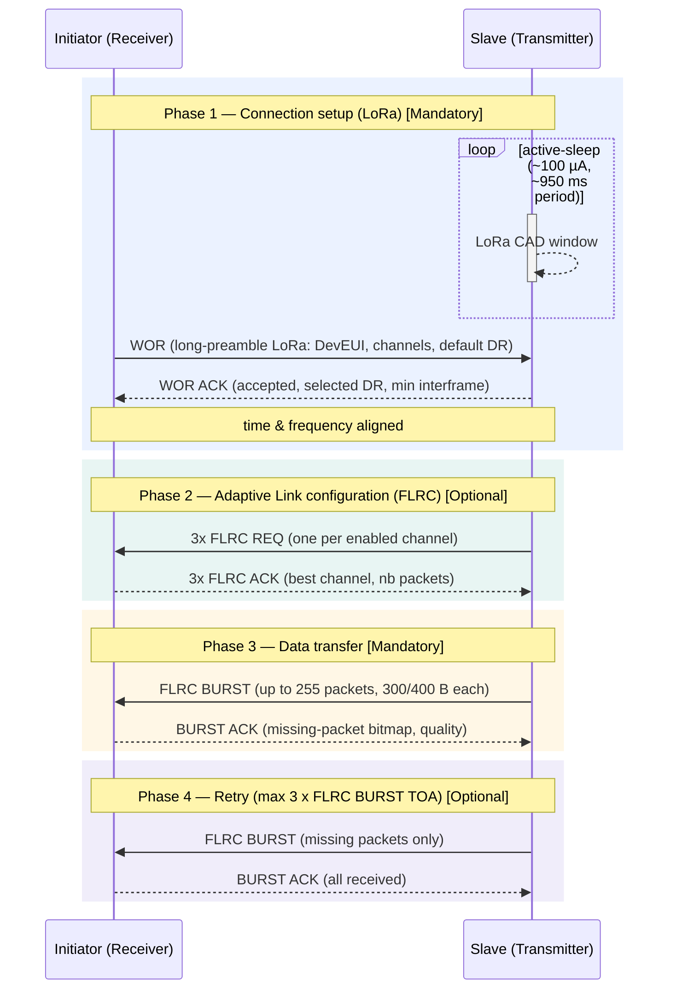

# FLRP-BURST — Principles

### Overview

**FLRP** is a family of **FLRC**-based features. **FLRP-BURST** is its first member and
provides high-throughput **file / bulk data transfer**; more FLRP features will follow.

FLRP-BURST wraps a very high speed **FLRC** burst (up to 2.6 Mbps) after a
short **LoRa** exchange used to synchronize the two devices in **time and frequency** before the
burst. This combines the throughput of FLRC with the robustness and low power of LoRa.

The protocol transfers a significant amount of data between **two devices** and is organized in
**4 phases** (connection setup, link configuration, data transfer & acknowledgment of missing data, retry).

### Roles and directions

Two role pairs are used and must not be confused:

- **Initiator / Slave** — fixed roles for the *session*. The **initiator** always starts the
  protocol by sending the WOR; the **slave** wakes up and answers.
- **Transmitter / Receiver** — roles for the *data direction*, set by the WOR "Transfer
  Direction" bit. The **transmitter** is the device that sends the FLRC burst (and the FLRC REQ);
  the **receiver** is the device that receives the burst (and sends the BURST ACK and the
  min-interframe-delay).

| Transfer Direction | Initiator role | Slave role | Typical use case |
|--------------------|----------------|------------|------------------|
| `0` (Initiator receives) | Receiver   | Transmitter | Sensor data upload |
| `1` (Initiator sends)    | Transmitter | Receiver    | Firmware / config download |

> The **WOR is always sent by the initiator**. The **FLRC REQ is always sent by the transmitter**,
> and the **BURST ACK is always sent by the receiver**, whichever physical device that is.

### Transfer phases

FLRP-BURST runs in **4 phases**. The **[Mandatory]** / **[Optional]** tag of each phase matches the
sequence diagram below.

#### Phase 1 — Connection setup: WOR + WOR ACK (LoRa) · [Mandatory]

- The **initiator** sends a **long-preamble LoRa WOR** (target DevEUI, enabled channels, default
  FLRC datarate, control flags).
- The **slave** does *not* stay in continuous reception: it periodically opens a very short LoRa
  **CAD / preamble-detection window** and sleeps in between (*active-sleep*). Because the initiator's
  preamble is longer than the slave's sleep period, the slave is guaranteed to catch it while keeping
  an **ultra-low average current** (not possible with FLRC alone).
- The slave then answers with a LoRa **WOR ACK** (request accepted, selected datarate, its min
  interframe delay).
- After this exchange both devices are **time and frequency aligned**.
- The **WOR phase is mandatory**.

> See [Low-power wake-up](#low-power-wake-up) for the two prepared presets.

#### Phase 2 — Adaptive Link configuration: FLRC REQ + FLRC ACK (FLRC) · [Optional]

- This phase is **configurable**: fully enabled, **disabled**, or limited to channel-selection only,
  or run without selection.
- When enabled, the **transmitter** sends a **FLRC REQ** **on each enabled channel** — i.e. as many
  FLRC REQ as there are enabled channels (3 by default → 3× FLRC REQ), repeated with the
  **adaptive-link interframe delay** (`adaptive_link_interframe_delay_us`, distinct from the burst
  interframe). Each FLRC REQ carries the next **full payload size** of the FLRC BURST (= total transfer size) and the
  **uniform packet size** (= same payload length for every burst packet, chosen to minimize padding).
- The **receiver** answers with a **FLRC ACK** (per channel), selecting the **best channel**, the
  **FLRC datarate** (available soon), the **burst mode** and the **number of packets**, based on
  measured RSSI / frequency offset. The same information is sent on each channel.
- **When disabled**, the payload size is not negotiated: the receiver expects a payload of the
  **exact size of its RX buffer** and the **burst interframe must match** on both sides (datarate,
  coding rate and channel are still carried by the WOR). See
  [Configuration](FLRP_guidelines.md#configuration) for details.

#### Phase 3 — Data transfer: FLRC BURST + BURST ACK · [Mandatory]

- The transmitter sends a back-to-back **burst** of FLRC packets of **300 or 400 bytes** (depending
  on the coding rate).
- The payload is **not encrypted**; integrity is **optional**: when `crypto_enabled` is set, a
  per-packet **MIC** (AES-CMAC) is added **in place of the radio CRC**. If `crypto_enabled` is not set, radio CRC is used.
- The **receiver** replies with a **BURST ACK** reporting **missing packets** (bitmap) and link-quality feedback.
- Whether missing packets are reported at all depends on the **accepted PER target**
  (`burst_target_per`, default 5 %): a burst whose loss stays within the target is considered valid.
  One-way and stream modes use **no burst ACK**.

#### Phase 4 — Retry · [Optional]

- Retransmission is **governed by the accepted PER**: only if the residual loss exceeds
  `burst_target_per` does the transmitter resend **only the missing packets** in a new burst
  (followed by a new BURST ACK).
- The duration of the retransmission sequence cannot exceed 3 times the duration of the Phase 3 (max 3 x FLRC BURST TOA).
- If the loss is within the target — or the burst ACK is disabled (one-way / stream) — there is
  **no retry**, so the mechanism can effectively be turned off.
- *Note: the **400 ms** value is the maximum duration of a **single burst** (dwell-time limit), not
  a retry-count limit.*

### Low-power wake-up

The slave catches the WOR with **periodic LoRa CAD** (short detection window + active-sleep), not
continuous RX. Two coherent presets are prepared in [`flrp_configuration.h`](../../modules/lib/usp/protocols/smtc_flrc_protocol/flrp_configuration.h)
(`WOR_LORA_LONG_PREAMBLE_MS` / `RESTART_WOR_RX_DELAY_MS`, which must always be switched together),
trading wake-up latency against **which side is optimized for low power**:

- **Preset A (default) — low power on the receiver (slave):** long preamble **1 s**, slave RX
  period ~962 ms → slave RX duty cycle **~1.3 %**, wake-up latency up to ~1 s. The initiator
  (transmitter) pays the cost of the long preamble.
- **Preset B — low power on the transmitter (initiator):** short preamble **100 ms**, slave RX
  period ~92 ms → slave RX duty cycle **~13 %** (10× preset A), wake-up latency up to ~100 ms
  (10× faster).
- **Custom presets are possible:** any other coherent `WOR_LORA_LONG_PREAMBLE_MS` /
  `RESTART_WOR_RX_DELAY_MS` pair can be defined to trade wake-up latency against slave duty cycle —
  see [Guidelines → WOR wake-up preset](FLRP_guidelines.md#wor-wake-up-preset-custom).

### Why FLRP-BURST rather than FLRC alone?

> **More on FLRP-BURST advantages:** for a deeper description of the FLRP-BURST benefits, refer to the **Semtech
> Application Notes** available on the [Semtech website](https://www.semtech.com/products/wireless-rf/lora-plus).
> The **README files** in this repository provide the tools to **configure FLRP-BURST and enable / put in
> practice these advantages** (see the [FLRP overview](FLRP.md) and its linked examples).

Used on its own, FLRC has two well-known weaknesses, especially at the low coding rates (CR 1/2,
2/3) needed for best sensitivity:

- **False detections** — to maximize sensitivity the detection threshold is set low, which causes
  the receiver to trigger on noise. This raises the effective packet error rate.
- **Frequency-offset sensitivity** — FLRC demodulation is sensitive to a residual frequency
  error between the two devices (crystal tolerance, temperature, Doppler). This sensitivity **gets
  worse as the datarate decreases**: the FLRC frequency tolerance shrinks with the raw bitrate, from
  about **±150 kHz at 2.6 Mbps down to ±25 kHz at 0.26 Mbps** (LR20xx datasheet §18.1.4). Beyond
  that tolerance the burst is no longer demodulated.

FLRP-BURST fixes both by prepending a **LoRa WOR exchange** that synchronizes in time & frequency the two devices before the
FLRC burst:

- The FLRC Rx window is opened only briefly and only one detector/correlator runs after sync
  - → **false detections drastically reduced**, so the lower Coding Rate (1/2) can be used to gain **1 to 2 dB extra sensitivity** in AWGN environment (conducted).
  - → **consumption reduced**, by using less detectors/correlators.
- The **frequency offset is measured on the LoRa WOR packet** (`lora_freq_offset_hz`) and
  **automatically applied to pre-align the FLRC receiver** (`rx_frequency_offset_in_hz`).
  **Frequency-offset management is always enabled in FLRP-BURST** — it is intrinsic to the FLRP-BURST WOR exchange. The associated tunable is **`crystal_error`**
  (local clock accuracy in ppm, in
  `smtc_flrp_api_config_t`), which sizes the frequency/timing margin FLRP-BURST applies and lets it cope
  with up to **~60 ppm**. Pre-aligning FLRC this way also gives **lower FLRC consumption**.
- **Timing is synchronized** to the WOR, and an **ultra-low-power LoRa CAD** mode
  enables active sleep — impossible with FLRC alone.

The FLRC BURST prevent from false detections & get the most of transfer bitrate with:
- Long series of frames with **shortest interframe** and a preference for **long packets
  (300-400 bytes)** keep the channel busy and prevent false detections from dominating the PER curve.
- Automatic calculation of the largest suitable packet length suitable for the selected coding rate (300-400 bytes) preventing from clock drift, maximum being +60ppm.

Measured FLRP-BURST performance allow to go beyond the radio datasheet results with FLRC alone.

---

See also: [FLRP-BURST — Guidelines](FLRP_guidelines.md) · [FLRP overview](FLRP.md)
