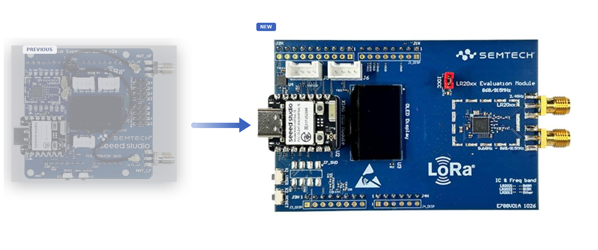

# LoRa Plus™ Evaluation Kit (EVK)

The new **[LoRa Plus™ Evaluation Kit](https://www.semtech.com/products/wireless-rf/end-nodes-ics)** is the reference hardware used by the USP / USP-for-Zephyr
samples. It is built around Semtech's **4th-generation LoRa® transceivers** paired with **Seeed
XIAO nRF54L15** host modules, and supports **LoRa®, FLRC (up to 2.6 Mbps), LR-FHSS** and more.

Each kit ships with **2 RF boards + 2 XIAO nRF54L15 modules**, antennas, USB cables and a
quick-start guide — enough to run the point-to-point examples (ping-pong, PER, FLRP, …) out of the
box.

*LoRa Plus™ Evaluation Kit*

This new EVK replaces the previous one, but the USP software remains compatible with both versions. The compilation command lines are unchanged.

## Transceivers: LR2021 vs LR2022 vs LR2012

All three are **4th-generation LoRa® IP** transceivers (QFN32 5×5 mm, single switch-less front-end,
best LoRa sensitivity down to **-141.5 dBm @ SF12/125 kHz**, increased frequency-offset tolerance —
no TCXO required) and share **LoRa (≤ 125 kbps), (G)FSK, OOK and LR-FHSS**. They differ by band
coverage and by the extra PHYs:

| Feature | [LR2021](https://www.semtech.com/products/wireless-rf/lora-plus/lr2021) | [LR2022](https://www.semtech.com/products/wireless-rf/lora-plus/lr2022) | [LR2012](https://www.semtech.com/products/wireless-rf/lora-plus/lr2012) |
|---------|:------:|:------:|:------:|
| Bands | sub-GHz + 2.4 GHz + licensed L/S-band | sub-GHz + 2.4 GHz + NTN (L/S) | **sub-GHz only** |
| **FLRC / FLRP** (up to 2.6 Mbps) | ✅ | ❌ | ❌ |
| Bluetooth® LE PHY | ✅ | ✅ | ❌ |
| O-QPSK (802.15.4 — Thread / Zigbee) | ✅ | ❌ | ❌ |
| Z-Wave | ✅ | ❌ | ❌ |
| Positioning | Full feature set, dual-band | Subset of LR2021 (no FLRC / O-QPSK / Z-Wave) | Sub-GHz-only subset (LoRaWAN, Wi-SUN, wM-Bus, FSK) |

In short: **LR2021** = full dual-band including **FLRC** (required for FLRP); **LR2022** = LR2021
without FLRC / O-QPSK / Z-Wave; **LR2012** = sub-GHz-only subset of LR2022.

## Variants

The kit comes in several variants, across three transceiver families. Please have a look at [Semtech LoRa Plus EVK page](https://www.semtech.com/products/wireless-rf/hardware-development-tools-kits) .
