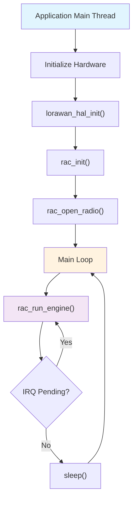
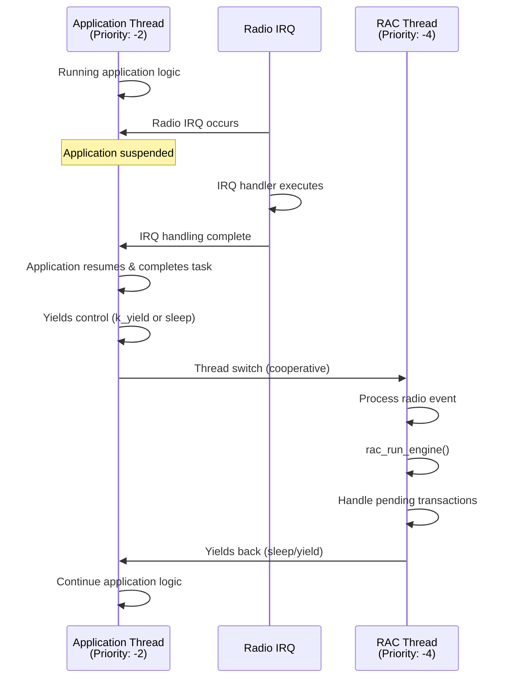
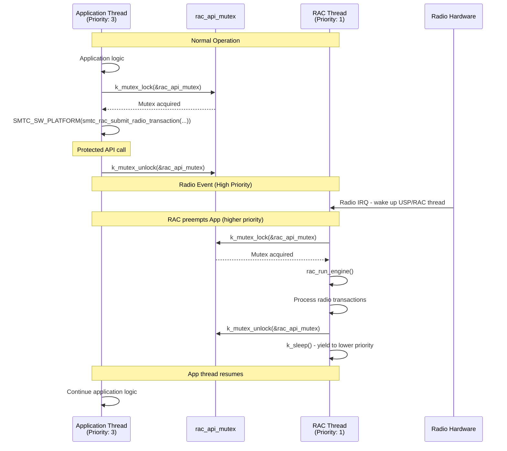
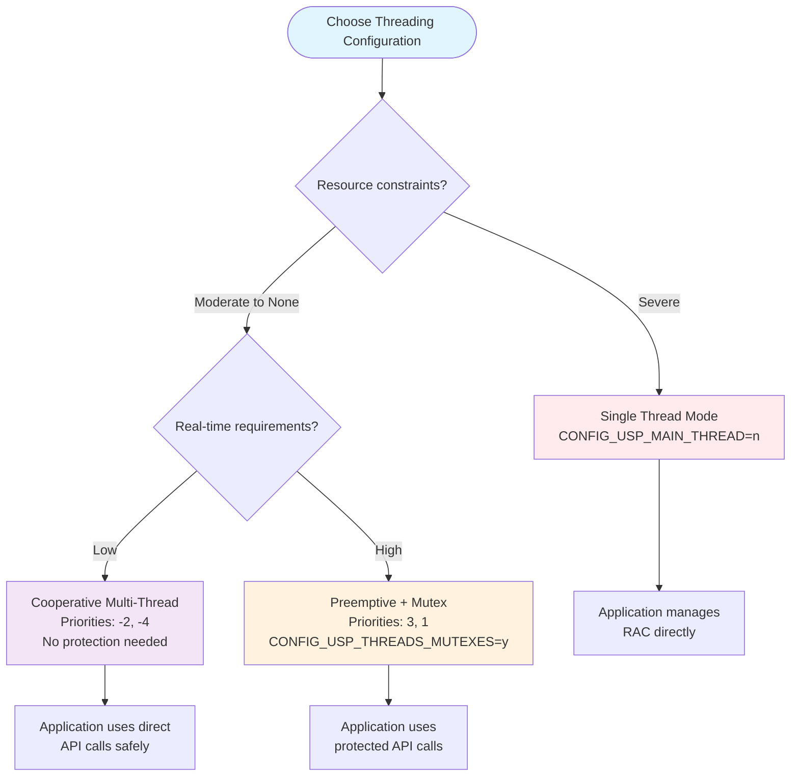

# Thread Management in USP for Zephyr

## Overview

The USP implementation for Zephyr provides flexible thread management options to accommodate different application requirements and system architectures. This document describes the various thread configurations available and their implications for application development.

## Thread Architecture Options

The USP Zephyr implementation supports multiple threading models controlled by Kconfig options:

### 1. Single Thread Mode (No USP/RAC Thread)
- **Configuration**: `CONFIG_USP_MAIN_THREAD=n`
- **Description**: The application thread directly manages the USP/RAC
- **Use case**: Simple applications, resource-constrained systems

### 2. Multi-Thread Mode (With USP/RAC Thread)
- **Configuration**: `CONFIG_USP_MAIN_THREAD=y`
- **Description**: Separate dedicated thread for USP/RAC management
- **Sub-configurations**:
  - **Cooperative threading** (no protection needed) (use of `CONFIG_MAIN_THREAD_PRIORITY`, `CONFIG_USP_MAIN_THREAD`)
  - **Preemptive threading with mutexes** (use of `CONFIG_MAIN_THREAD_PRIORITY`, `CONFIG_USP_MAIN_THREAD`, `CONFIG_USP_THREADS_MUTEXES=y`)

## Configuration Matrix

| Mode | CONFIG_USP_MAIN_THREAD | Threading Model | Protection Method | MAIN_THREAD_PRIORITY | USP_MAIN_THREAD_PRIORITY | MUTEXES |
|------|--------------------------------|------------------|-------------------|---------------------|----------------------|---------|
| **Single Thread** | `n` | N/A | None | N/A | N/A | N/A |
| **Cooperative Multi-Thread** | `y` | Cooperative | None (safe by design) | `-2` | `-4` | `n` |
| **Preemptive + Mutex** | `y` | Preemptive | Mutex protection | `3` | `1` | `y` |

## Threading Models Explained

### Single Thread Mode

In this mode, the application is responsible for:
- Initializing the USP/RAC
- Managing the radio transceiver
- Running the RAC engine
- Handling sleep/wake cycles



**Advantages:**
- Lower memory footprint
- Direct RAC API call
- Simpler debugging
- No thread synchronization complexity

**Disadvantages:**
- Application must manage RAC stimulation
- Potentially higher latency for radio events
- Integration of other SW components is more complex

### Cooperative Multi-Thread Mode

Two threads with cooperative scheduling (negative priorities):
- Main thread priority: `-2`
- USP/RAC thread priority: `-4`



**Key Characteristics:**
- **No preemption**: Threads voluntarily yield control
- **Sequential execution**: Only one thread runs at a time
- **IRQ handling**: IRQ → Application completion → USP/RAC thread scheduling
- **No protection needed**: Thread switching only at yield points

**Advantages:**
- No need for mutex/queue protection
- Predictable execution order
- Lower overhead than preemptive threading
- Integration of other SW components is easier than single thead

**Disadvantages:**
- Less responsive to urgent radio events
- Application must not block for long periods
- No direct RAC API call


### Preemptive Multi-Thread with Mutexes

Two threads with preemptive scheduling and mutex protection:
- Main thread priority: `3`
- USP/RAC thread priority: `1` (higher priority)



**Key Characteristics:**
- **Preemptive scheduling**: Higher priority thread can interrupt lower priority
- **Mutex protection**: `rac_api_mutex` protects all API calls
- **Reactive**: USP/RAC thread responds immediately to radio events
- **Thread safety**: Mutex ensures atomic API operations

**Advantages:**
- Highly responsive to radio events
- Better real-time performance
- Clean separation of concerns
- Integration of other SW components is easier than single thead

**Disadvantages:**
- Mutex overhead
- Potential for priority inversion
- More complex debugging
- No direct RAC API call

## API Abstraction Layer

The `SMTC_SW_PLATFORM` macros provide a unified API that adapts based on configuration:

### Single Thread Mode
```c
#define SMTC_SW_PLATFORM(call) call
#define SMTC_SW_PLATFORM_VOID(call) call
```
Direct pass-through to RAC API.

### Multi-Thread with Mutexes
```c
#define SMTC_SW_PLATFORM(call)                          \
    ({                                                  \
        k_mutex_lock(&rac_api_mutex, K_FOREVER);      \
        __auto_type __result = (call);                  \
        k_mutex_unlock(&rac_api_mutex);               \
        __result;                                       \
    })
```
Automatic mutex protection around each API call.

## Configuration Selection Guide

Use this decision tree to choose the appropriate threading configuration for your application:



## Application Development Guidelines

### For Single Thread Mode
1. Initialize RAC in main()
2. Implement main loop with:
   - `smtc_rac_core_run_engine()`
   - IRQ flag checking
   - Sleep management
3. Handle all radio callbacks in main thread context

### For Cooperative Multi-Thread Mode
1. Wait for USP/RAC initialization: `zephyr_rac_initialization_wait()`
2. Use direct API calls via `SMTC_SW_PLATFORM` macros
3. Ensure application doesn't block for extended periods
4. No special protection needed for API calls

### For Preemptive Multi-Thread Mode
1. Wait for USP/RAC initialization: `zephyr_rac_initialization_wait()`
2. Use `SMTC_SW_PLATFORM` macros (automatic protection)
3. API calls are synchronous and protected with mutexes
4. Protect any shared application data in radio callbacks

## Performance Characteristics

| Characteristic | Single Thread | Cooperative | Preemptive + Mutex |
|----------------|---------------|-------------|--------------------|
| **Memory Usage** | Lowest | Low | Medium |
| **CPU Overhead** | Lowest | Low | Medium |
| **Radio Responsiveness** | Application-dependent | Good | Excellent |
| **API Call Latency** | Direct | Direct | Mutex overhead |
| **Determinism** | High | High | Medium |
| **Debugging Complexity** | Lowest | Low | Medium |

## Configuration Examples

### Low-Power Sensor (Cooperative)
```ini
CONFIG_USP_MAIN_THREAD=y
CONFIG_MAIN_THREAD_PRIORITY=-2
CONFIG_USP_MAIN_THREAD_PRIORITY=-4
CONFIG_USP_THREADS_MUTEXES=n
```

### Real-Time Gateway (Preemptive + Mutex)
```ini
CONFIG_USP_MAIN_THREAD=y
CONFIG_MAIN_THREAD_PRIORITY=3
CONFIG_USP_MAIN_THREAD_PRIORITY=1
CONFIG_USP_THREADS_MUTEXES=y
```

## Priority Inversion and Deadlock Prevention

When using **preemptive threading with mutexes**, priority inversion can occur where a high-priority thread (USP/RAC) waits for a mutex held by a lower-priority thread (Application), while an intermediate-priority thread prevents the lower-priority thread from completing.

### Zephyr Solutions

To prevent deadlocks and priority inversion issues, enable these Zephyr capabilities in your `prj.conf`:

```ini
# Priority inversion protection
CONFIG_KERNEL_MEM_POOL=y              # Enable advanced kernel objects
CONFIG_MUTEX_PRIORITY_INHERITANCE=y   # High-priority thread inherits mutex holder's priority
CONFIG_PRIORITY_CEILING=y             # Mutex raises holder's priority to ceiling level
```

### Alternative Approaches

- **Use cooperative threading** (negative priorities) - eliminates preemption-related issues entirely
- **Minimize critical sections** - reduce mutex hold time to decrease inversion probability
- **Add timeouts** - prevent indefinite blocking with `K_MSEC()` instead of `K_FOREVER`

## Troubleshooting

### Common Issues

1. **Priority inversion with mutexes**
   - Use priority inheritance mutexes
   - Adjust thread priorities
   - Minimize critical section duration

2. **Poor radio responsiveness in cooperative mode**
   - Reduce application processing time
   - Add more yield points
   - Consider preemptive mode

### Debug Tips

1. **Enable logging** to trace thread execution
2. **Monitor thread statistics** via Zephyr shell
3. **Use debugger** to inspect mutex states
4. **Validate priorities** match intended behavior

## Conclusion

The USP Zephyr implementation provides flexible threading options to meet diverse application requirements. Choose the appropriate configuration based on your system's performance, power, and complexity requirements.

For most applications, **cooperative threading** provides the best balance of simplicity and performance. Use **preemptive threading with mutexes** when radio responsiveness is critical and you need synchronous, protected API calls.
