## Architecture

The objective of the Unified Software Platform (USP) Architecture is to allow
-	the use of multiple protocols supported by the radio,
-	easy integration of new MCU and related boards,
-	easy integration of new Radio and related boards,
-	easy use of the SW in a modern SW development environment.


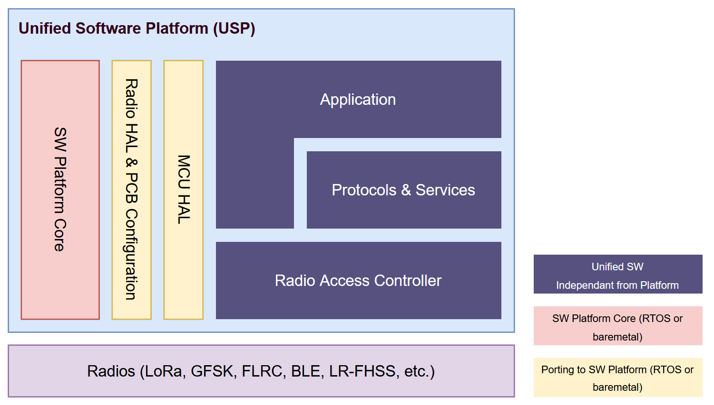

The main SW components:
-	Radio Access Controller (RAC)
    -	allows a unified access to radios
    -	manages the time scheduling of requests from the application, the protocols, and other services,
    -	brings with the drivers of the different radios.
-	Protocols
    -	provides a database of existing protocols and services compliant with Radio Access Controller: LBM
    -	can be extended with other protocols based on provided documentation and SW glue.
-	MCU HAL, Radio HAL& BSP tools to allow porting on multiple HW boards.
-	Sample applications  including Multi-Protocol capabilities demonstrators

The first selected SW Platforms is Zephyr RTOS. The USP components are integrated into Zephyr SW Platform as libraries & source code in an external git repository (zephyr module) with the exposition of a set of MCU HAL & Radio HAL & BSP tools being ported externally.

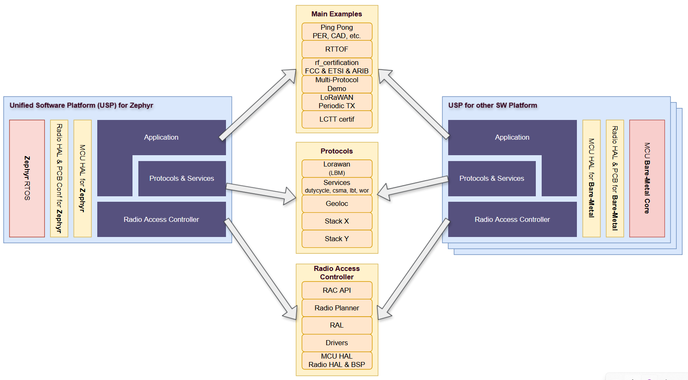

 The Main Examples, Protocols, and RAC lib SW components are platform-agnostic and independent from any SW Platform porting (RTOS, baremetal). Porting to a new SW Platform (RTOS, baremetal) primarly involves adapting the MCU HAL & Radio HAL & PCB configuration layers.


Repositories & file structure : Only 2 git repositories are provided by Semtech (black boxes). The two other are Zephyr git dependancy and the user application git repository.
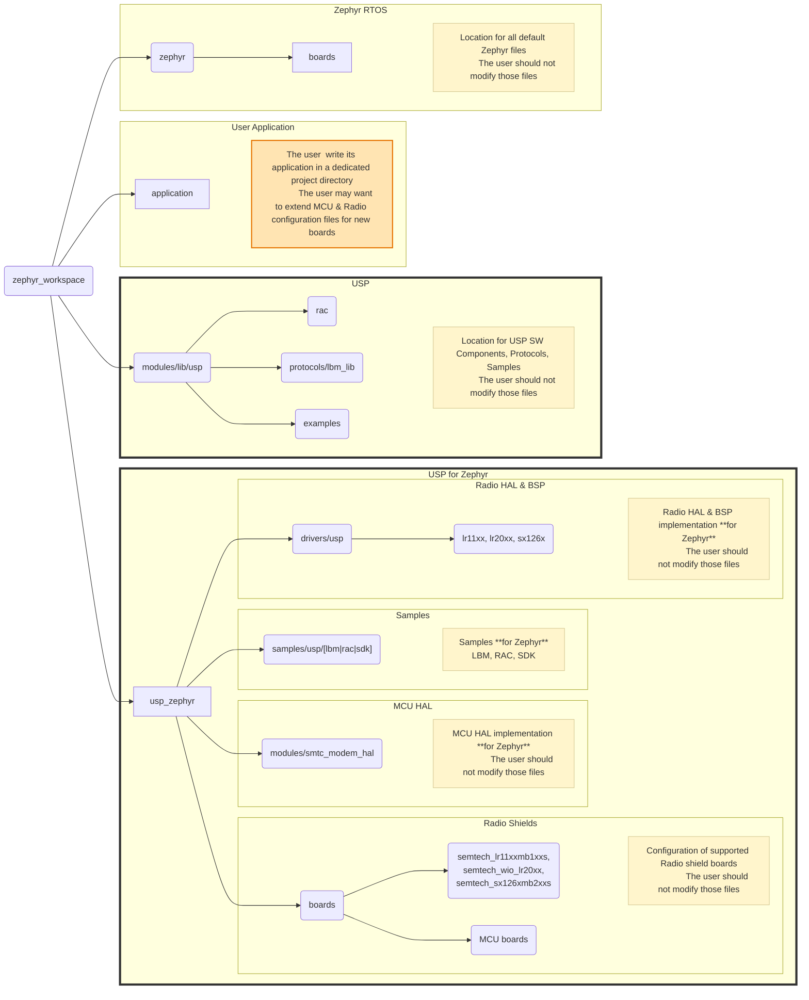

Directory Tree Format of the workspace of the user :
```bash
zephyr_workspace/
├── zephyr/
│   └── boards/
│       └── (default Zephyr files - do not modify)
├── application/
│   └── (user project - dedicated directory)
├── usp_zephyr/
│   ├── boards/
│   │   ├── semtech_lr11xxmb1xxs/
│   │   ├── semtech_wio_lr20xx/
│   │   ├── semtech_sx126xmb2xxs/
│   │   └── (MCU boards)/
│   ├── drivers/
│   │   └── usp/
│   │       ├── lr11xx/
│   │       ├── lr20xx/
│   │       └── sx126x/
│   └── modules/
│       └── lora_basics_modem/
│           └── smtc_modem_hal/
└── modules/
    └── lib/
        └── usp/
            ├── rac/
            ├── protocols/
            │   └── lbm_lib/
            └── examples/

```
Organization notes:
```
- zephyr/ : Default Zephyr RTOS files (do not modify) - **git module automatically fetched from zephyr**
- application/ : User project (modifiable) - **user directory**
- usp_zephyr/ : SW Platform for Zephyr (do not modify) - **SEMTECH main git repository : The only entry point for users**
  ├── boards/ : Configuration of supported radio shield boards
  ├── drivers/ : Radio HAL & BSP implementation for Zephyr
  └── modules/ : MCU HAL implementation for Zephyr
- modules/lib/usp/ : LoRa Multi-Protocol SW Components (do not modify) - **SEMTECH git repository**
```
Everything is automatically managed using the `west.yml` manifest.

## LoRa Basics Modem

**LoRa Basic Modem** proposes a full implementation of the [TS001-LoRaWAN L2 1.0.4](https://resources.lora-alliance.org/technical-specifications/ts001-1-0-4-lorawan-l2-1-0-4-specification) and [Regional Parameters RP2-1.0.3](https://resources.lora-alliance.org/technical-specifications/rp2-1-0-3-lorawan-regional-parameters) specifications.

**LoRa Basic Modem** embeds an implementation of all LoRaWAN packages dedicated to Firmware Update Over The Air (FUOTA):

- Application Layer Clock Synchronization (ALCSync) [TS003-1.0.0](https://resources.lora-alliance.org/technical-specifications/lorawan-application-layer-clock-synchronization-specification-v1-0-0) / [TS003-2.0.0](https://resources.lora-alliance.org/technical-specifications/ts003-2-0-0-application-layer-clock-synchronization)
- Fragmented Data Block Transport [TS004-1.0.0](https://resources.lora-alliance.org/technical-specifications/lorawan-fragmented-data-block-transport-specification-v1-0-0) / [TS004-2.0.0](https://resources.lora-alliance.org/technical-specifications/ts004-2-0-0-fragmented-data-block-transport)
- Remote Multicast Setup [TS005-1.0.0](https://resources.lora-alliance.org/technical-specifications/lorawan-remote-multicast-setup-specification-v1-0-0) / [TS005-2.0.0](https://resources.lora-alliance.org/technical-specifications/ts005-2-0-0-remote-multicast-setup)
- Firmware Management Protocol (FMP) [TS006-1.0.0](https://resources.lora-alliance.org/technical-specifications/ts006-1-0-0-firmware-management-protocol)
- Multi-Package Access (MPA) [TS007-1.0.0](https://resources.lora-alliance.org/technical-specifications/ts007-1-0-0-multi-package-access)

**LoRa Basic Modem** embeds an implementation of the Relay LoRaWAN® Specification [TS011-1.0.1](https://resources.lora-alliance.org/technical-specifications/ts011-1-0-1-relay)

- Relay Tx (relayed end-device)
- Relay Rx
```
          +--------------------+       +------------------+
          | Wake On Radio      |       |     LoRaWAN      |
          | protocol + LoRaWAN |       | Class A, B, or C |
          +--------------------+       +------------------+
                    \                        /
                     \                      /
                      \                    /
         Relay Tx      v                  v
      ( End-Device ) <----> (Relay Rx) <----> (Gateway) <----> (Network Server)
              ^                                 ^
               \                               /
                -------------------------------
```

**LoRa Basic Modem** embeds an implementation of the LoRaWAN certification process
- LoRaWAN certification process [TS009-1.2.1](https://resources.lora-alliance.org/technical-specifications/ts009-1-2-1-certification-protocol)

**LoRa Basic Modem** offers:
- Geolocation services in combination with LoRa Edge chips

### LoRa Basics Modem library

LoRa Basics Modem library code can be found in folder `protocols/lbm_lib` .
Please refer to `README.md`[LOCAL](../../modules/lib/usp/protocols/lbm_lib/README) [ONLINE](https://github.com/Lora-net/usp/blob/main/protocols/lbm_lib/README.md) to get all information related to LoRa Basics Modem library

## Radio Access Controller (RAC) API

- Documentation for the USP API is available in [LOCAL](../../modules/lib/usp/smtc_rac_lib/README.md) [ONLINE](https://github.com/Lora-net/usp/blob/main/smtc_rac_lib/README.md)
- API is avalable here : [LOCAL](../../modules/lib/usp/smtc_rac_lib/smtc_rac_api/smtc_rac_api.h) [ONLINE](https://github.com/Lora-net/usp/blob/main/smtc_rac_lib/smtc_rac_api/smtc_rac_api.h)

## Dynamic Behaviour, Priorities, ASAP & Scheduled transactions


### lorawan vs ranging when ranging is low priority

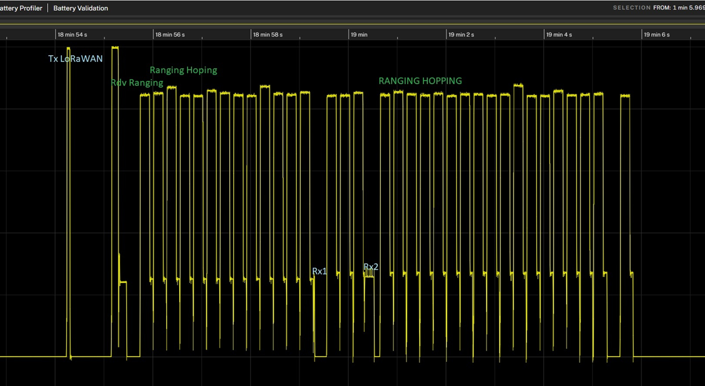
1. uplink LoRaWAN : TX
2. Ranging is started
3. When collision is expected, one ranging round is canceled to allow LoRaWAN RX1 & RX2
4. Ranging go on when possible

### lorawan vs ranging when ranging is very high priority

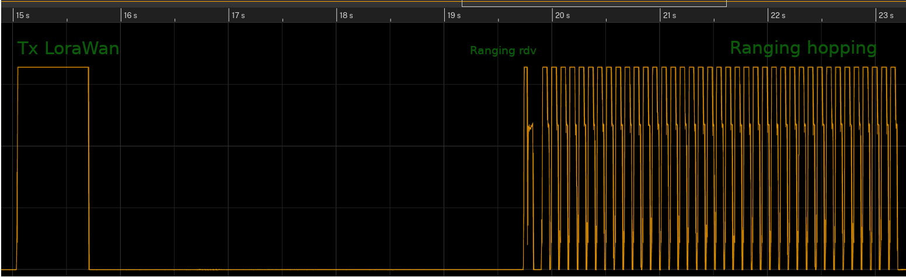
1. uplink LoRaWAN : TX
2. Ranging is started
3. When collision is expected, LoRaWAN RX1 & RX2 are canceled to allow ranging to continue

### Multi-protocol management

USP/RAC is managing the time scheduling of Modulation Transactions.

#### Principles

- If a scheduled transaction is scheduled but conflicts with another one of higher priority, it is aborted
- If a scheduled transaction is scheduled but conflicts with another request of lower or equal priority not yet finished, the request is aborted at the scheduled date.
- If a ASAP transaction conflicts with another transaction, it is postponed. After a while (defined delay), the ASAP transaction is promoted to a scheduled one and fired as soon as a window is found.
- In other cases, the transactions are scheduled at programmed timestamp in sequence.

In case a transaction is aborted:
- `smtc_usp_submit_radio_transaction()` returns `SMTC_USP_SUCCESS`.
- `callback_pre_radio_transaction()`  is not triggered
- `callback_post_radio_transaction()` is triggered with `RP_STATUS_TASK_ABORTED` rp_status_t at the timestamp when the selected transaction has successfully completed just after Its successful Handle Event

#### Normal Case with scheduled or ASAP Modulation Transactions
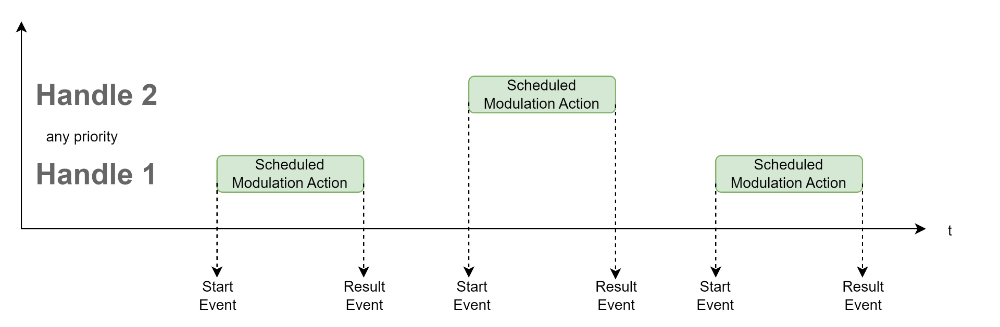

#### Case with Modulation Actions of different priorities and time conflicts:
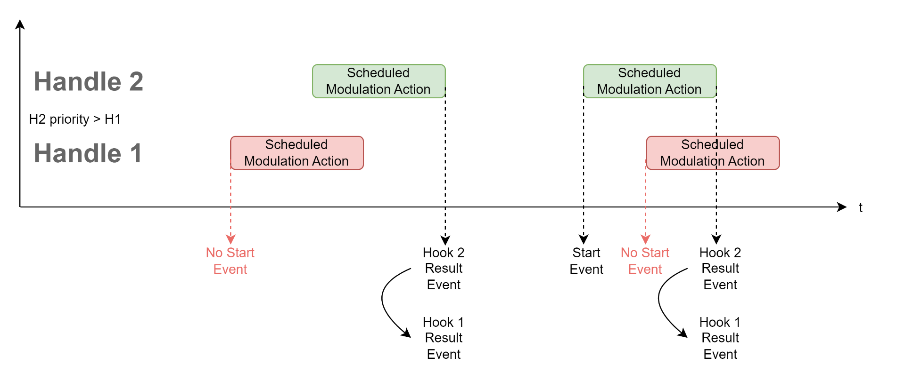
<u>Notes</u>:
- In Red, the scheduled transaction that failed because of time conflict
- In case the transaction failed,
    - the `callback_pre_radio_transaction()` Start Event is not called,
    - the `callback_post_radio_transaction()` Result Event is called after the successful transaction called its `callback_post_radio_transaction()` Result Event

#### Cases with mixed ASAP & scheduled Modulation Actions and time conflicts

ASAP transaction is programmed but cannot be fired before the end of a scheduled transaction of any priority:
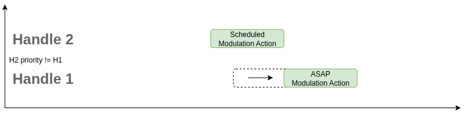

In case the ASAP transaction is postponed for too long time, after 120 seconds, It is promoted as a scheduled transaction in order to have more change to be fired:
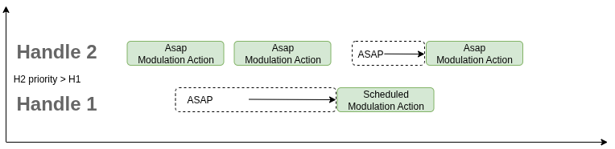

In case ASAP transaction priority is lower than scheduled priority, It is cancelled:
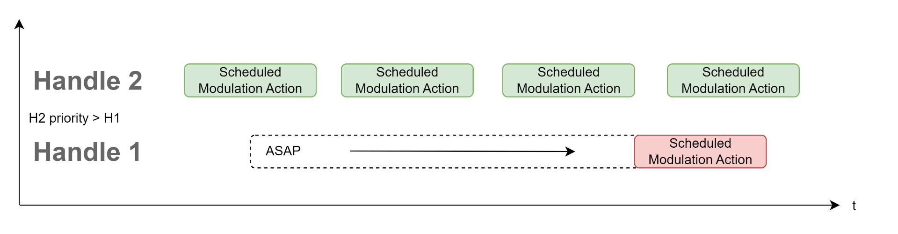
<u>Notes</u>:
- In Red, the scheduled transaction that failed because of time conflict

In case ASAP transaction priority is higher than scheduled priority, It is postponed during maximum 120 seconds and then promoted as scheduled. The lowest scheduled transaction is then canceled.

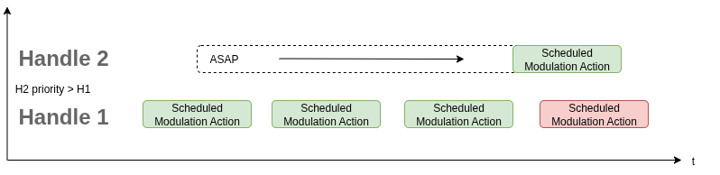

<u>Notes</u>:
- In Red, the scheduled transaction that failed because of time conflict

## Zephyr Integration

The USP implementation provides flexible thread management options to accommodate different application requirements and system architectures. For detailed information about thread management, see [**Thread Management Documentation**](THREAD_MANAGEMENT.md).

### Quick Threading Overview

The implementation supports multiple threading models:

- **Single Thread Mode** (`CONFIG_USP_MAIN_THREAD=n`): Application directly manages USP/RAC
- **Multi-Thread Mode** (`CONFIG_USP_MAIN_THREAD=y`):
  - **Cooperative**: Threads with negative priorities, no protection needed
  - **Preemptive + Mutexes**: Higher priority USP/RAC thread with mutex protection

Each mode offers different trade-offs between simplicity, performance, and real-time responsiveness. The application API remains consistent across all modes through the `SMTC_SW_PLATFORM` macro abstraction.
